# MocPhim — Sequence Diagrams

> Sử dụng [Mermaid](https://mermaid.js.org/) syntax. Render trực tiếp trên GitHub / VS Code / Obsidian.

---

## 1. Đăng ký & Xác thực Email

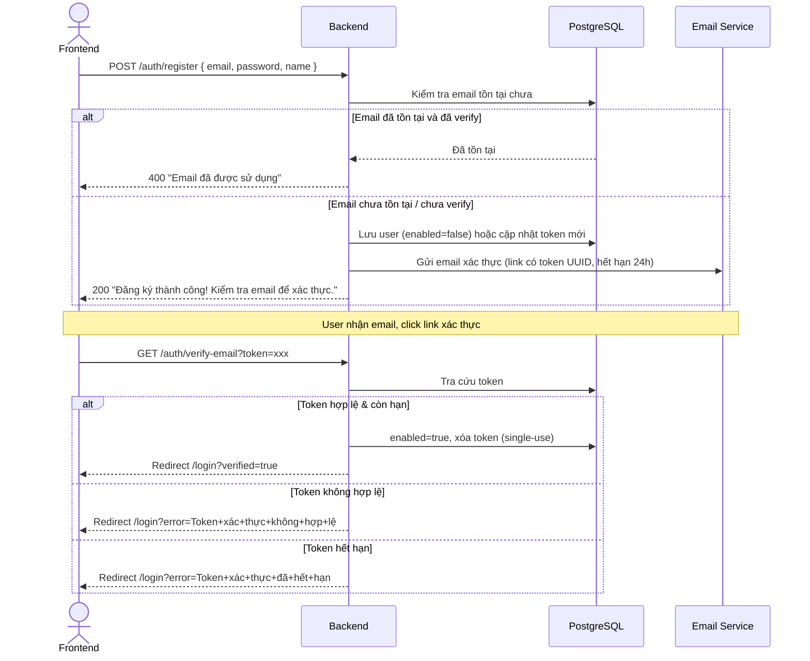

---

## 2. Đăng nhập Local (Email/Password)

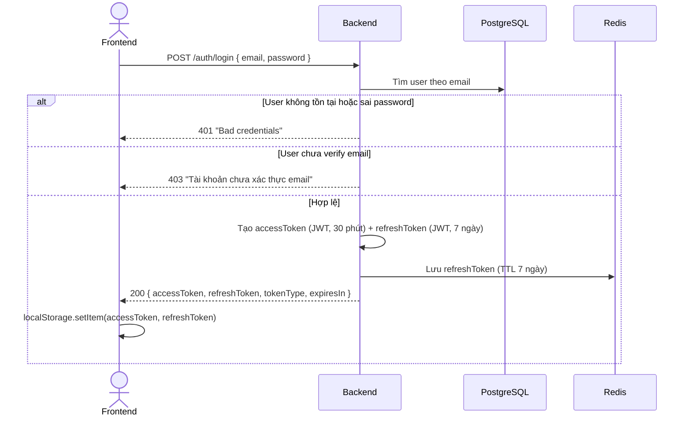

---

## 3. Làm mới Access Token (Refresh)

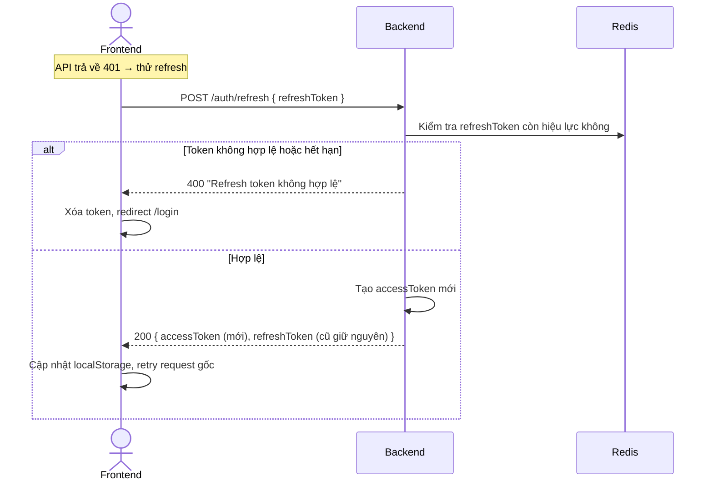

---

## 4. Đăng nhập Google OAuth2

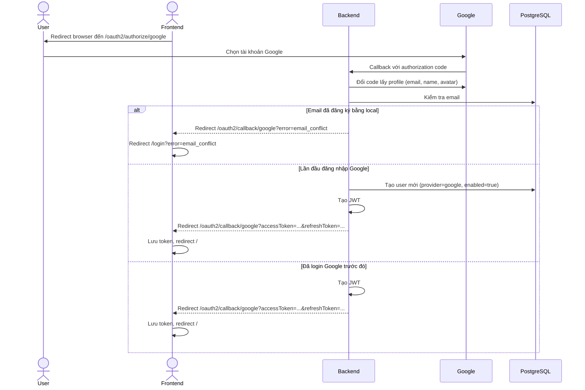

---

## 5. Quên mật khẩu & Đặt lại mật khẩu

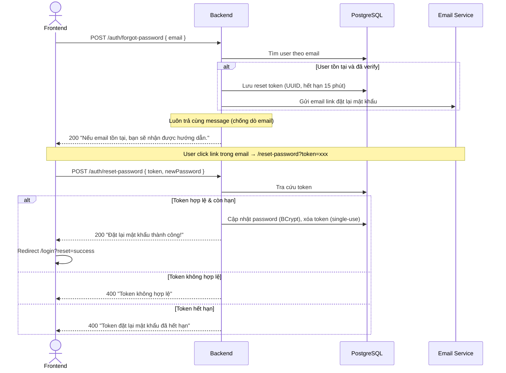

---

## 6. Gọi API với Auth (JWT Filter)

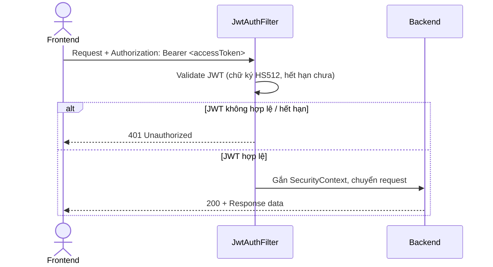

---

## 7. Bookmark

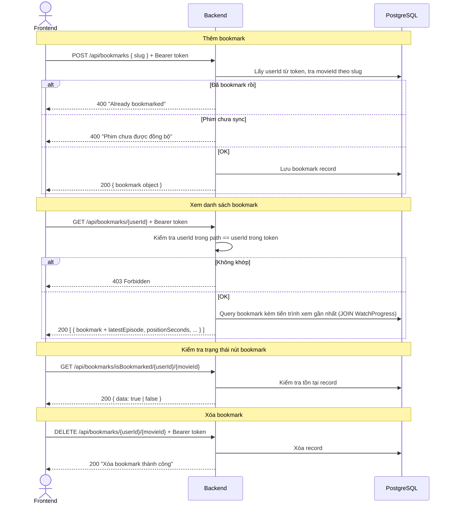

---

## 8. Watch Progress (Tiến trình xem)

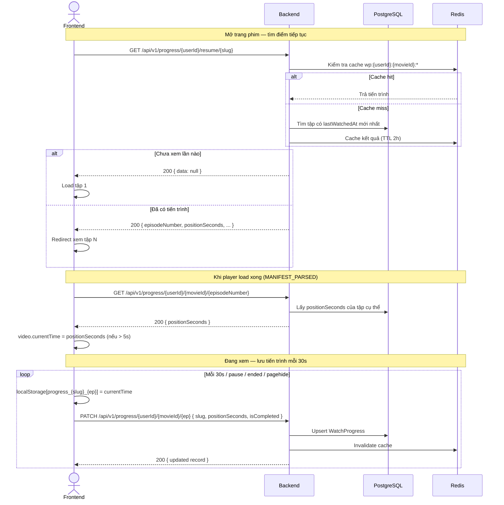

---

## 9. Comments (Bình luận)

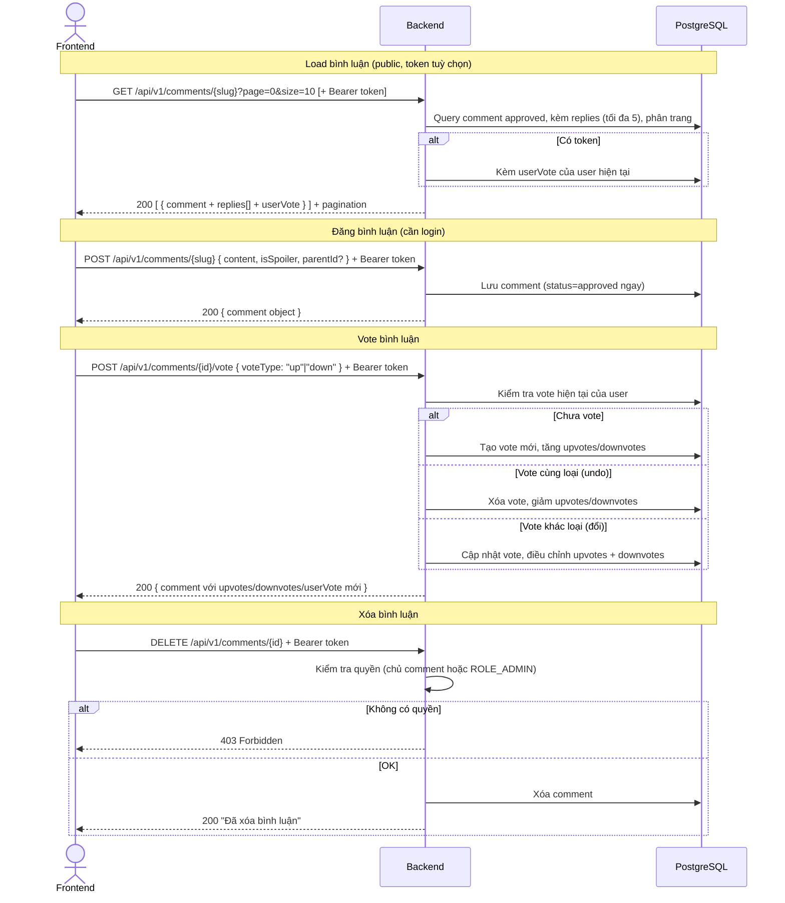

---

## 10. Views (Lượt xem)

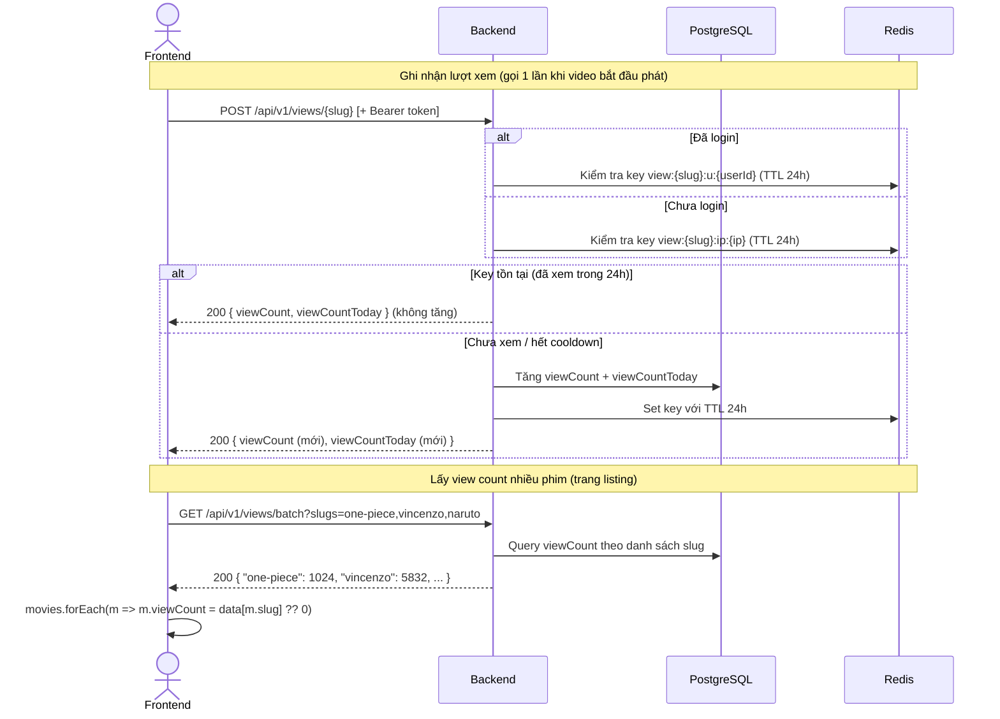

---

## 11. Admin — Sync Phim từ OPhim

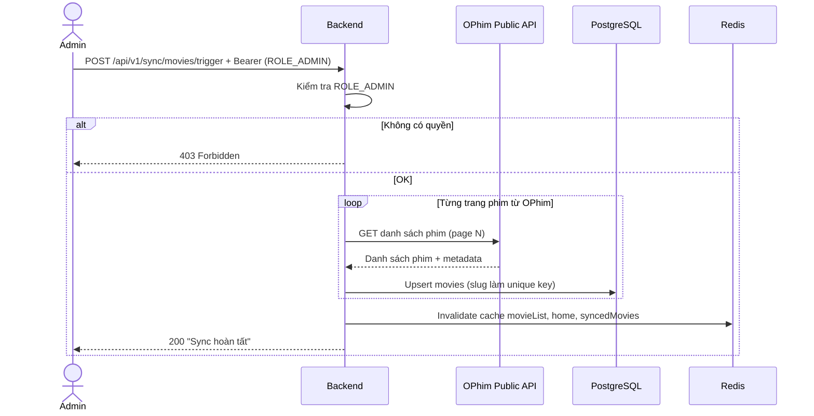
